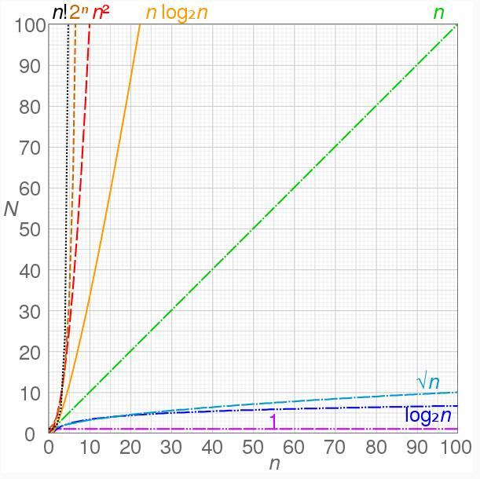

# Асимптотическая сложность алгоритмов

---

**Будем выделять асимптотики:**

* **@cpu** — **Вычислительнуая асимптотика** _(временная сложность)_ — сколько операций потребуется совершить компьютеру;
* **@ram** — **Пространственная асимптотика** _(пространственная сложность)_, т.е.  — сколько памяти потребуется для работы нашего алгоритма;


---



## O(1) — Константная сложность:
Константное время нахождение результата, не зависит от входных данных. 

_"**1**" символизация того, что что-то происходит во время работы алгоритма. 
~~Если бы файлы не передавались (а компьютер был выключен), то сложность была бы O(0)~~_
```
public class Class1 {

    // CPU: O(1)
    // RAM: O(1)
    public static int multiplication(int a, int b) {
        return a * b;
    }
}
```

## O(log(n)) — Логарифмическая сложность:
Обычно используется логарифм от **2**, если не указано иное. 
Алгоритм с производительностью **O(log (N))** делит количество рассматриваемых им элементов 
на фиксированный̆ коэффициент при каждом шаге.

_К алгоритмам с такой сложностью относятся алгоритмы типа **“Разделяй и Властвуй”** (Divide and Conquer)
Пример — **бинарный поиск**. Если массив отсортирован, мы можем проверить, есть ли 
в нём какое-то конкретное значение, методом деления пополам. Проверим средний элемент, если он 
больше искомого, то отбросим вторую половину массива — там его точно нет. Если же меньше, то 
наоборот — отбросим начальную половину. И так будем продолжать делить пополам, 
в итоге проверим **log n** элементов._
```
public class Class2 {

    // CPU: O(lon (n))
    // RAM: O(1)
    private static int binarySearch(int[] sortedArray, int valueToFind, int low, int high) {
        int index = -1;

        while (low <= high) {
            int mid = (low + high) / 2;
            if (sortedArray[mid] < valueToFind) {
                low = mid + 1;
            } else if (sortedArray[mid] > valueToFind) {
                high = mid - 1;
            } else if (sortedArray[mid] == valueToFind) {
                index = mid;
                break;
            }
        }
        return index;
    }
    
    public static void main(String[] args) {
        int[] values = {1, 1, 2, 3, 4, 10};
        int valueToFind = 3;
        System.out.printf("Index = %d%n", binarySearch(values, valueToFind, 0, values.length - 1));
    }
}
```

## O(sqrt(n)) — Корень из n:
_На каждой итерации мы перепрыгиваем на шаг, равный **sqrt(N)**. Алгоритмы с производительностью **O(sqrt (N))**, где **sqrt** — функция извлечения квадратного корня, не являются общими.
Эта функция возрастает очень медленно, хотя и несколько быстрее, чем **log (N)**._
```
import java.util.ArrayList;
import java.util.List;
public class Class3 {

    // CPU: O(sqrt(x)), т.к. выбираем худший случай мжду   O(log(x))   и   CPU: O(sqrt(x));
    // RAM: O(1);
    // Написать функцию, которая принимает число X (1 <= X <= 10^16). Возвращает массив  
    //    содержащий все уникальные простые делители в порядке возрастания. 
    //    (X является простым, если оно не делится ни на какое число до sqrt(X) (включительно));
    public static long[] calcPrimeNumbers(long x) {
        long[] results;
        if (x > 1) {
            final long maxValue = (long) Math.sqrt(x) + 1;
            long divider = 2L;
            List<Long> resultsList = new ArrayList();

            while (divider <= maxValue) {   // CPU: O(sqrt(x));
                if (x % divider == 0 ) {
                    resultsList.add(divider);
                    while (x % divider == 0) {   // CPU: O(log(x));
                        x /= divider;
                    }
                }
                divider++;
            }
            if (x != 1) { resultsList.add(x); }
            results = resultsList.stream().mapToLong(Long::longValue).toArray();
        } else { results = new long[0]; }
        return results;
    }
}
```
[Ещё примеры](https://proglib.io/p/6-search-algorithms-java)

## O(n) — линейная
Алгоритм FindLargest (см. пункт «Правило 1» подраздела «Асимптотическая сложность алгоритма» в разделе «Свойство алгоритма» текущей главы) имеет производительность O(N).
Функция N возрастает быстрее, чем log (N) и sqrt (N), но все же не так быстро, поэтому большинство подобных алгоритмов демонстрирует на практике хорошую производительность.
```
public class Class4 {

    // CPU: O(n)
    // RAM: O(1)
    public static int sum(int a) {
        int sum = 0;
        for (int i = 0; i < a; i++) {
            sum++;
        }
        return sum;
    }
}
```

## O(n * log n) — Линеарифметический _(квазилинейная сложность)_
Означает, что удвоение размера входных данных увеличит время выполнения чуть более, чем вдвое.
Т. е. время выполнения растет пропорционально **n * log n** входных данных.
Примеры алгоритмов с такой сложностью: **Сортировка слиянием**.

Предположим, что алгоритм перебирает все элементы в поставленной задаче, а затем в отдельном 
цикле выполняет с элементом какую-то операцию **O(log (n))**. В этом случае производительность 
алгоритма определяется выражением **O(n * log n)** или **O(n log n)**.

_Как вариант, задача может выглядеть так: алгоритм выполняет операцию **O(log (n))** и на каждом 
ее шаге что-то делает с каждым элементом. Предположим, у вас есть отсортированное дерево, 
содержащее **n** элементов (как описано выше) и такой же размерности массив.
Вам надо узнать, какие из элементов массива присутствуют в дереве.
Один из способов выяснить это — осуществить циклическое прохождение по величинам массива, 
задействовав описанный ранее метод поиска по дереву. В процессе работы алгоритм проверит 
**N** элементов и выполнит **log (n)** шагов для каждого из них, так что общая производительность 
будет **O(n * log n)**. Для многих алгоритмов сортировки, основанных на сравнении элементов, 
время работы составляет **O(n * log n)**._
```
public class Class5 {

    // CPU: O(n * log n)
    // RAM: O(1)
    public static void sum(int n) {
      for (int i = 1; i <= n; i++){
        for(int j = 1; j < n; j = j * 2) {
          System.out.println("Hey - I'm busy looking at: " + i + " and " + j);
        }
      }
    }
}
```

## O(n^2) — квадратичная _(Алгоритмы с полиномиальным временем)_
Алгоритм, который изначально перебирает все входные данные, а затем 
пересматривает их еще раз для каждого единичного значения, имеет производительность **O(n^2)**.


_Означает, что удвоение размера входных данных увеличивает время выполнения в 4 раза. Такую сложность имеет, например, алгоритм **сортировки вставками**. В канонической реализации 
он представляет из себя два вложенных цикла: один, чтобы проходить по всему массиву, а второй, 
чтобы находить место очередному элементу в уже отсортированной части. Таким образом, количество 
операций будет зависеть от размера массива как **n * n**, т. е. **n^2** Если алгоритм имеет 
квадратичную сложность, то это повод пересмотреть необходимость использования данного алгоритма._
```
public class Class6 {

    // CPU: O(n^2)
    // RAM: O(1)
    public static void sum(int n) {
      for (int i = 1; i <= n; i++) {
        for(int j = 1; j <= n; j++) {
          System.out.println("Hey - I'm busy looking at: " + i + " and " + j);
        }
      }
    }
}
```

## O(n^3) — кубическая
_Равстет еще быстрее, чем квадратичная_
```
public class Class7 {

    // CPU: O(n^3)
    // RAM: O(1)
    public static void sum(int n) {
      for (int i = 1; i <= n; i++) {
        for(int j = 1; j <= n; j++) {
          for(int k = 1; k <= n; k++) {
            System.out.println("Hey - I'm busy looking at: " + i + " , " + j + " and " + k);
          }
        }
      }
    }
}
```

## O(2^n) — экспоненциальная _(Алгоритмы с экспоненциальным временем)_
Эти алгоритмы растут пропорционально некоторому коэффициенту, экспоненциальному размеру входных данных.
Обычно посредством алгоритмов с подобным временем работы ищется оптимальный̆ набор входных данных.

_В качестве примера рассмотрим следующую задачу. Допустим, у вас есть рюкзак определенной 
грузоподъемности и набор принадлежностей̆, каждая̆ из которых имеет свою массу и значение.
Вам необходимо наполнить рюкзак предметами так, чтобы их общее значение оказалось наибольшим.
Задача может показаться простой, но все известные алгоритмы для нахождения наилучшего решения 
потребуют изучить каждую возможную комбинацию предметов. Если учесть, что любой̆ предмет 
способен пребывать только в двух состояниях (находиться в рюкзаке или вне его), то, умножив 
количество состояний на количество предметов, получим **2 * 2 * ... * 2 = 2N** вариантов выбора.
Иногда нет необходимости проверять все возможные комбинации. Например, если первый предмет 
заполняет собой рюкзак, то добавлять к нему еще что-то уже не имеет смысла. Однако в большинстве 
случаев вам не удастся исключить достаточное количество вариантов, чтобы значительно сузить 
область поиска._

При решении задач с экспоненциальным временем работы часто пользуются эвристиками — 
алгоритмами, которые дают хорошие результаты, но не гарантируют, что они будут наилучшими.

Экспоненциальное и факториальное время работы, описанное ниже, возрастает очень быстро, 
поэтому алгоритмы с указанной производительностью будут применимы только 
для **небольшого** количества входных данных.

```
public class Class8 {

    // CPU: O(2^n)
    // RAM: O(1)
    public static void sum(int n) {
      for (int i = 1; i <= Math.pow(2, n); i++){
        System.out.println("Hey - I'm busy looking at: " + i);
      }
    }
    
    // Рекурсивный рассчет числа Фибоначи
    // CPU: O(2^n)
    // RAM: O(1)
    public static int getFibonachi(int n) {
      if (n < 2) {
        return n;
      }
      return getFibonachi(n - 1) + getFibonachi(n - 2)
    }
}
```

## O(n!) — факториальная
_В большинстве случаев это настолько плохо, насколько это возможно.
В алгоритмах с факториальным временем работы, как правило, ищется **оптимальное 
распределение входных данных**. Классическим примером этого является решение.
**проблемы коммивояжера** с использованием метода _грубой силы_ для ее решения 
(Его задача — составить маршрут таким образом, чтобы посетить каждый̆ населенный пункт один раз 
и вернуться в отправную точку, преодолев минимальное расстояние. Если городов немного, то все 
просто, но если список длинный̆, задача усложняется на порядок. Наиболее очевидный̆ способ решения 
— перебрать все возможные варианты маршрута. Так, с помощью алгоритма можно выбрать **N** 
близлежащих населенных пунктов для первого города. После этого у вас останется **N – 1** 
возможных пунктов, которые еще нужно посетить, затем **N – 2** и т. д. Следовательно, 
общее количество вариантов маршрутов составит **N * (N – 1) * u (N – 2) * ... * 1 = N!** )._
```
public class Class9 {

    // CPU: O(n!)
    // RAM: O(1)
    public static void sum(int n) {
      for (int i = 1; i <= factorial(n); i++){
        System.out.println("Hey - I'm busy looking at: " + i);
      }
    }
}
```


---
**Выводы:**
1. **Big O**   показывает **тамп роста функции**. Следовательно, **мы не учитываем константы и "неважную" сложность.**;
2. Последовательные действия - **сложение**;  Вложенные действия - **умножение**.;
3. Для алгоритма, где **на каждой итерации берется половина элементов** - сложность будет включать   **O (log N)**;

---
**Шпаргалка** _(Небольшие подсказки, которые помогут определить сложность алгоритма.)_:
1. [x]    Получение элемента коллекции это **O(1)**. Будь то получение по индексу в массиве, или по ключу в словаре в нотации _Big O_ это будет **O(1)**.
2. [x]    Перебор коллекции это **O(n)**.
3. [x]    Вложенные циклы по той же коллекции это **O(n^2)**.
4. [x]    Разделяй и властвуй _(Divide and Conquer)_ всегда **O(log n)**.
5. [x]    Итерации которые используют “Разделяй и властвуй” (Divide and Conquer) это **O(n log n)**;
6. [x]    Вложенные циклы **НЕ перемножаются**, если на каждой новой итерации внешнего цикла, внутренний не обнуляется, а продолжает с какого-то значения.

---
**Полезные ссылки**
  + [**Оценка сложности алгоритма**. _25-мин. видео. Доступно (и с примерами) основы анализа сложности алгоритмов.;_](https://youtu.be/ZRdOb4yR0kk)
  + [**Big O** - _статья на хабре о Big O.;_](https://habr.com/ru/post/444594/)
  + [**Знай сложности алгоритмов** - _статья о врем. вып. и о расх. памяти большинства алгоритмов.;_](https://habr.com/ru/post/188010/)
  + [**сам источник.**](https://bimlibik.github.io/posts/complexity-of-algorithms/)

---

Полезные материалы:

[Задачи с Google, Facebook, Yandex](https://youtube.com/playlist?list=PLVpozZzXIif_0UOkBfgblzMblEwdiVeBq)


---


