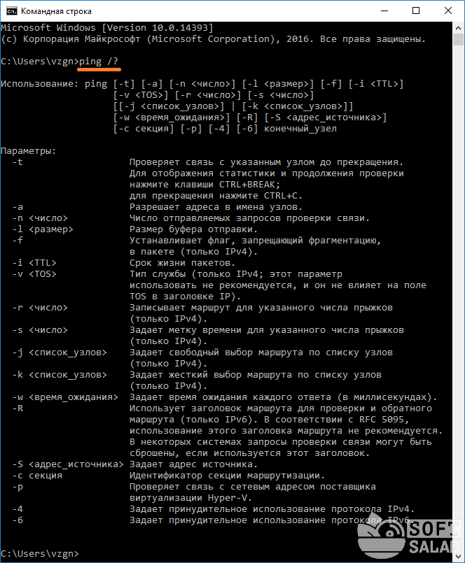
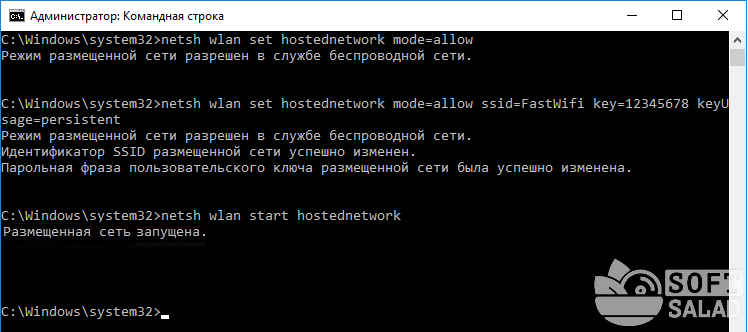
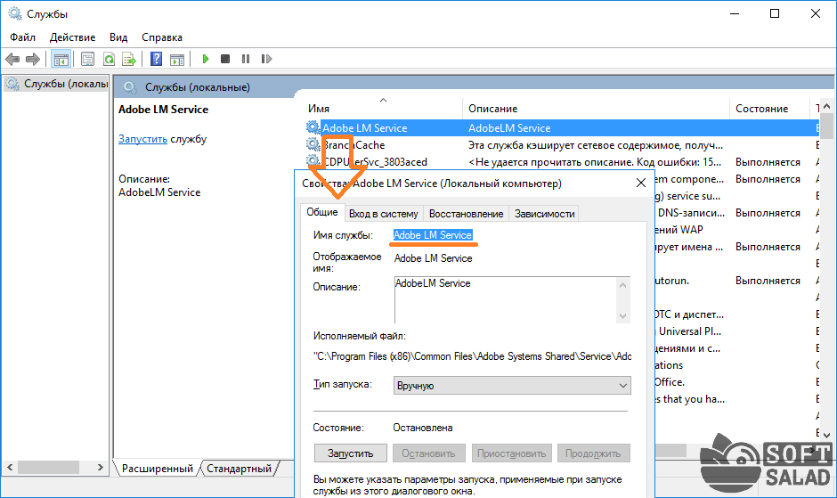
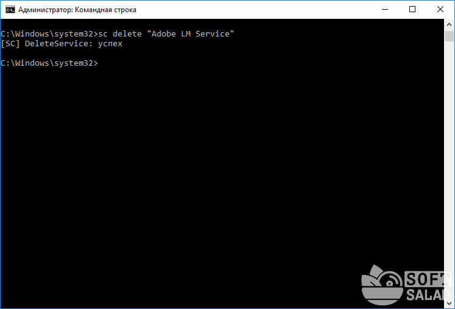
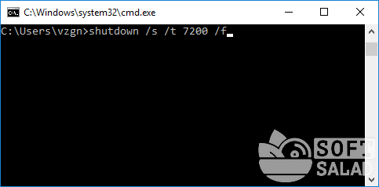
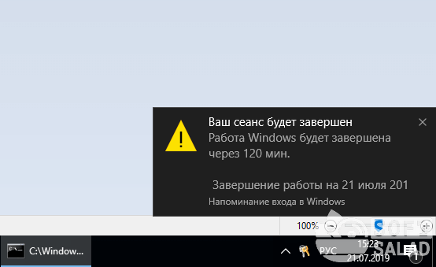
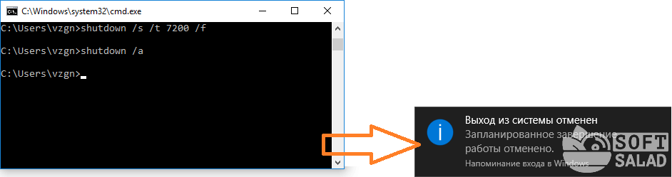
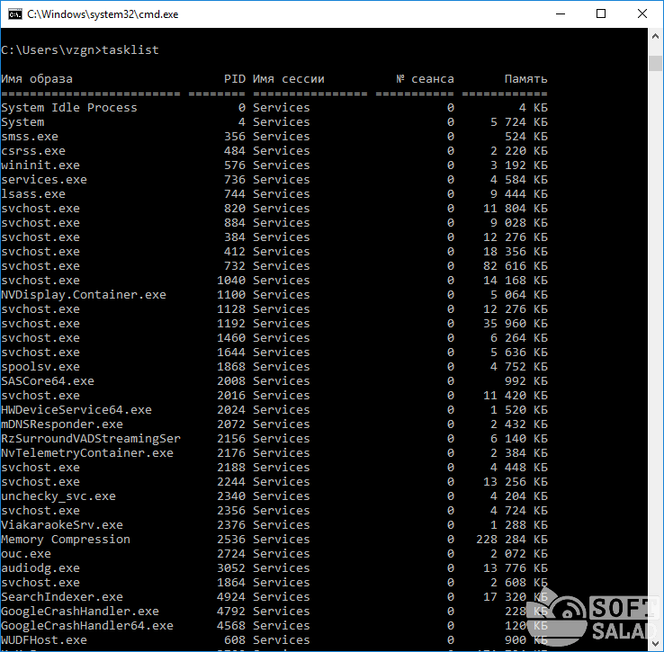
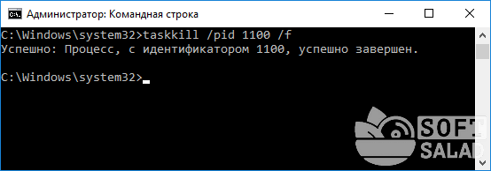
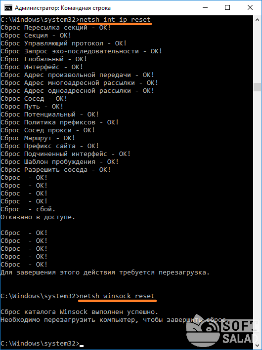

# Командная строка Windows

---

cmd

По любой команде можно получить помощь прямо в окне интерпретатора. Для этого следует сразу после команды вписать "**/?**"
К примеру, одну из наиболее востребованных команд ping. Впишите в консоль следующую строку:

`ping /?`



---


`control` — запуск "Панели управления Windows"

`regedit` — запуск "Редактора реестра".

`devmgmt.msc` — запуск "Диспетчера устройств".

`taskmgr` — запуск "Диспетчера задач".

`services.msc` — запуск приложения "Службы".

`appwiz.cpl` — "Программы и компоненты" ("Установка и удаление программ").

`calc` — запуск "Калькулятора".

`mspaint` — запуск графического редактора "Paint".

`notepad` — запуск текстового редактора "Блокнот".

`wordpad` — запуск текстового редактора "WordPad"

`Sfc` - утилита System File Checker. Используется для проверки целостности компонентов Windows. `sfc /scannow` автоматически проверяет все системные файлы и самостоятельно восстанавливает поврежденные фрагменты;

`Recover` — консольная утилита для восстановления данных с поврежденных носителей. `recover D:\`. Сохранившиеся данные извлекаются. Однако битые секторы игнорируются. Поэтому для работы с накопителями, у которых много сбойных секторов, инструмент не очень подходит. Команда работает только с накопителями, отформатированными в файловой системе **NTFS**. **~~FAT и FAT32~~** не поддерживаются.

`Wbadmin` - инструмент архивации данных. С его помощью можно осуществить резервное копирование или восстановление дисков, папок и файлов. Команда начала резервного копирования выглядит как `wbadmin start backup` с дополнительными атрибутами. Восстановление осуществляется командой `wbadmin start recovery`, также имеющей собственные атрибуты для указания источника и пути восстановления.

`Chkdsk` — команда, которая проводит диагностику файловой системы и устраняет обнаруженные ошибки. Работает с файловыми системами **FAT**, **FAT32** и **NTFS**

`Cipher` — команда для шифрования файлов на уровне файловой системы **NTFS**. В домашнем использовании может понадобиться ключ `/w`. Данная команда затирает свободное место во всем томе. Это предотвращает возможное восстановление удаленных данных специализированными программами. Если накопитель пуст, «обнуляется» весь его объем.

`Defrag` — инструмент дефрагментации для жестких дисков.

`Diskpart` — утилита для управления разделами накопителей. Позволяет создавать, удалять и преобразовывать тома на дисках, изменять их атрибуты и помечать активными. Работа начинается с команды **list disk** или **list volume**.

`Fsutil` — служебная утилита управления объектами файловой системы. Помимо управления файлами, позволяет отсоединять, изменять размер и просматривать информацию о логических томах.

---

dir

cd

```C:\"Program Files"\Notepad++\notepad++.exe``` - Запуск/открытие программы/файлы в другой папке или на другом диске (имя папки "Program Files" взято в кавычки, т.к. в нем присутствует пробел). Перед названием файла можно указать путь до конечной папки, в которой тот будет создан (если не указать, файл создастся в текущей папке).

```copy nul простой_текстовый_файл.txt``` - Создание простого текстового файла

```mkdir папка``` - Создание папки. Папка создается в текущем местоположении.

```del простой_текстовый_файл.txt``` - Удаление файла (или нескольких). (если требуется удалить несколько файлов, просто вписываем их имена друг за другом через пробел). Удаляем созданный ранее файл.

``` rmdir папка``` - Удаление папки.

```ren простой_текстовый_файл.txt новое_имя_файла.txt``` / ```ren папка новое_имя_папки``` - Переименование файла / папки.

### Сетевые
```ping 173.194.73.139``` - Определим, есть ли связь с IP-адресом 173.194.73.139 (IP-адрес поисковой системы Google).

```ping softsalad.ru``` - определим IP-адрес сайта по его доменному имени. Возьмем адрес softsalad.ru .

```tracert softsalad.ru``` - команда применяется для отслеживания сетевого маршрута от компьютера до целевого IP-адреса (можно использовать и доменное имя сайта).

```ipconfig /all``` - С помощью этой команды можно получить информацию о настройках IP-протокола компьютера (или, грубо говоря — настройки сетевых карт). Воспользуемся данной командой с атрибутом /all, который позволит вывести более подробную информацию.

```getmac``` - Если требуется определить только MAC-адрес сетевой карты, используем эту команду без всяких атрибутов;

``` ```

``` ```

## РЕДКО ИСПОЛЬЗУЕМЫЕ, НО ОЧЕНЬ ПОЛЕЗНЫЕ КОМАНДЫ
Превращаем ноутбук в Wi-Fi-роутер (включение раздачи интернета с ноутбука или настольного компьютера с Wi-Fi-адаптером). Для реализации этой затеи нужно поочередно выполнить три несложные команды:

1. ```netsh wlan set hostednetwork mode=allow```

2. ```netsh wlan set hostednetwork mode=allow ssid= MiWiFi key= MiWiFipassword keyUsage=persistent```
Вместо **MiWiFi** и **MiWiFipassword** можно использовать свои фразы. Первый параметр задает имя беспроводной сети, второй — пароль (должен состоять из 8 символов или более)

3. ```netsh wlan start hostednetwork```


Если после выполнения каждой команды вы видите сообщения, аналогичные тем, что приведены на изображении выше, значит, все прошло успешно. Теперь к ноутбуку можно подключиться, например, с телефона так же, как и к обычному Wi-Fi-роутеру.


### Удалениям службу Windows (или любую другую) через командную строку
Если попробовать удалить службу через штатное приложение "Службы", то ничего не получится (в нем попросту не предусмотрено такой функции). Однако это бывает необходимым, особенно после установки различных программ, которые устанавливают службы, но "забывают" их удалять при деинсталляции. Это легко реализуется через командную строку. Однако для начала необходимо узнать имя службы, и это можно сделать через стандартное Windows-приложение:
1. Запустите программу "**Службы**", используя команду ```msc```
2. Найдите в отобразившемся списке службу, которую необходимо удалить, и кликните по ней два раза мышкой:
   
3. Нас интересует текст в блоке "Имя службы"
4. Теперь вернитесь в окно командной строки и впишите в него команду: `sc delete имя_службы`
5. Подставьте вместо фразы "имя_службы" имя удаляемой службы. Если оно содержит пробелы, как в нашем случае, заключите имя службы в кавычки
   
6. Служба удалена.

### Выключаем/перезагружаем/отправляем в сон/гибернацию компьютер с задержкой
Если необходимо выключить, перезагрузить или отправить в сон компьютер с задержкой по времени, не обязательно использовать какие-либо сторонние программы — все можно сделать при помощи командной строки. Для этого достаточно использовать команду: `shutdown /s /t 60 /f`

В данном случае компьютер будет выключен (параметр "**/s**") через 60 секунд (параметр "**/t 60**") с принудительным завершением работы всех приложений без предупреждения пользователя (параметр "**/f**" — обязательный при использовании таймера "**/t**").
* **/l** — завершение сеанса (выход из учетной записи пользователя с блокировкой, если для входа требуется пароль).
* **/r** — перезагрузка компьютера.
* **/hybrid /s** — "отправка" компьютера в сон (параметр "**/s**" использовать обязательно).
* **/h** — режим гибернации (или режим максимального энергосбережения, при котором ключевые компоненты компьютера остаются включенными).

Для выключения компьютера, например, **через 2 часа** следует указывать в параметре "**/t**" число **7200** (1 час равен 3600 секундам)



Сразу после выполнения команды на экран будет выведено уведомление:



Выполнение команды всегда можно отменить (если была использована задержка), воспользовавшись: `shutdown /a`




### Просмотр списка запущенных процессов и завершение работы любого из них
Если по каким-то причинам не удается запустить "Диспетчер задач", но имеется доступ к командной строке, запущенный процесс может быть снят при помощи специальных команд:

* Сначала выведем на экран список всех запущенных процессов при помощи команды tasklist: 



* Нас интересует идентификатор "**PID**" завершаемого процесса. Возьмем для примера PID процесс "**NVDisplay.Container.exe**" — **1100**.
  Для завершения его работы используем команду `taskkill /pid 1100 /f` (параметр "**/f**" необходим для принудительного завершения работы процесса)




### Чиним интернет при помощи командной строки
Разнообразные неполадки с сетевыми подключениями можно устранить "одним махом" через командную строку путем сброса настроек TCP/IP (не будем вдаваться в подробности)
Для выполнения этой задачи нужно поочередно ввести две команды: `netsh int ip reset` и `netsh winsock reset`



 * Перезагружаем компьютер для применения изменений.

``` ```

``` ```
``` ```
``` ```
``` ```
``` ```
``` ```
``` ```
``` ```
``` ```
``` ```
``` ```
``` ```
``` ```
``` ```
``` ```
``` `````` ```
``` ```
``` ```
``` ```
``` ```
``` ```
``` ```
``` ```
``` ```
``` ```
``` ```
``` ```
``` ```
``` ```
``` ```

---


[источник1](https://www.softsalad.ru/articles/instructions/windows-cmd-commands)

[источник2](https://club.dns-shop.ru/blog/t-328-prilojeniya/73674-konsolnyie-komandyi-windows-na-vse-sluchai-jizni/?utm_referrer=https%3A%2F%2Fyandex.by%2F)

